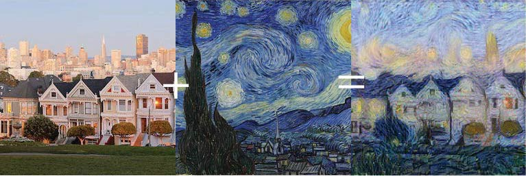

## Neural Style Transfer

 

  

## Model used - vgg16

## References
Paper : Leon A. Gatys, Alexander S. Ecker, Matthias Bethge.,A Neural Algorithm of Artistic Style

Blogs : 
1. https://heartbeat.fritz.ai/how-to-create-a-custom-loss-function-in-keras-637bd312e9ab

2. https://harishnarayanan.org/writing/artistic-style-transfer/

